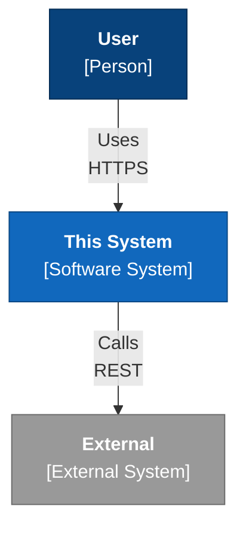

# {{title}}

> One sentence a stranger would understand: what it is and its real current status.

**Repo:** `` · **Build:** `` · **Status:** 

## Outcome

{What "done" looks like, in one falsifiable sentence. An end state, not activities.}

## Scope

**In scope**
- 

**Explicitly not in scope** — non-goals: things that could reasonably be goals that you are choosing not to pursue
- 

## Architecture at a glance

*Reference mode: facts only. Rationale lives in the ADRs below — if you catch yourself explaining "why" here, that's an ADR.*

| Layer | Stack |
|---|---|
|  |  |

### System context

<!--
  Use flowchart, NOT Mermaid's C4Context syntax — see [[C4 Model]]. C4 syntax can't link
  to notes, hardcodes colours (unreadable in dark mode), and is officially experimental.
  Quote every node label; unquoted parentheses break the parser.
  Wikilinks do NOT work inside Mermaid — put them in prose below the diagram.
  Draw Level 1 (context) and Level 2 (containers) only; deeper levels rot too fast.
-->

Components above: [[ ]] — link them here so the graph and backlinks can see them.

## Decisions

Index only — never restate a decision here.

| ADR | Decision | Status |
|---|---|---|
| [[ ]] |  |  |

## Runbooks

- [[ ]]

## Open questions

- [ ] {question} — *blocking: yes/no*

## Log

Staging area. Each entry either graduates — to an ADR, a runbook, or the changelog — or gets deleted. If it hasn't graduated in a month, it wasn't notable.

- **YYYY-MM-DD** — 
